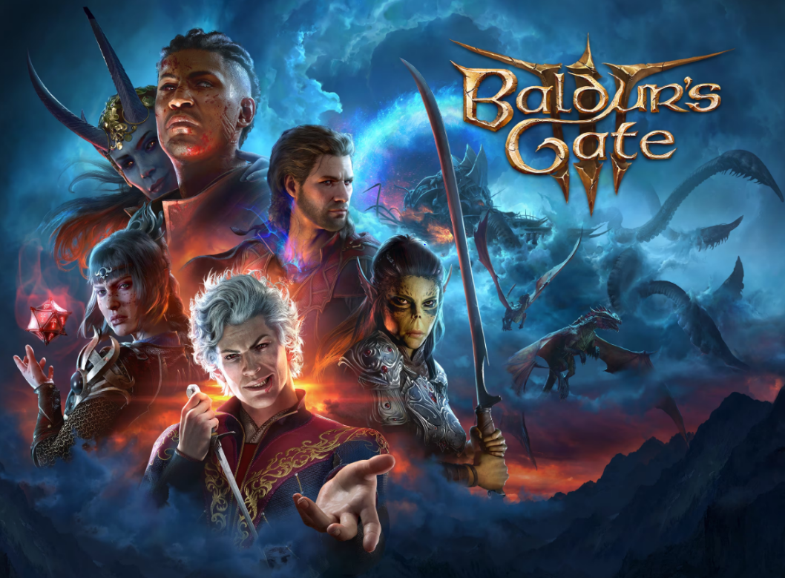
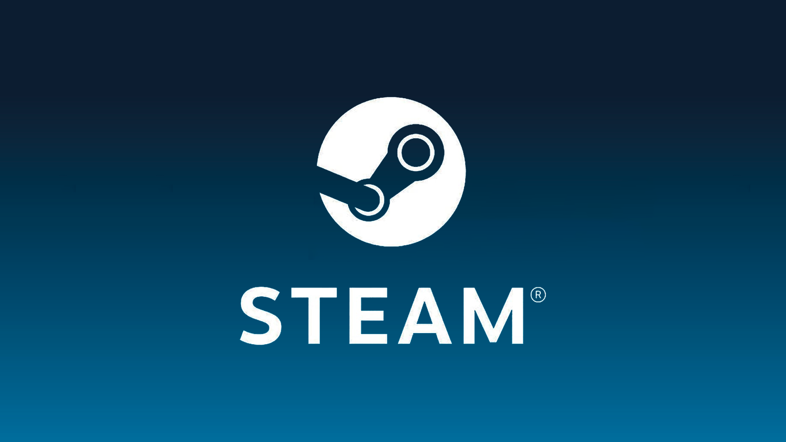

# Baldurs Gate 3 Steam Reviews Analytics

This is my project for the [Data Engineering Zoomcamp](https://github.com/DataTalksClub/data-engineering-zoomcamp/tree/main/) by [DataTalks.Club](https://datatalks.club/).  

## Index
- [Problem Description](#problem-description)
- [Dataset](#dataset)
- [Tech Stack](#technologies-used)
- [About the Project](#about-the-project)
- [Dashboard](#dashboard)
- [Reproducibility](#reproducibility)
- [Notable Notes](#notable-notes)
- [Acknowledgements](#acknowledgements)

## Problem Description

Analyzing user reviews of video games, particularly during different stages of their lifecycle, provides valuable insights into player perceptions and trends. This project is dedicated to exploring the Steam user reviews of Baldur's Gate 3, with a focus on two distinct phases: the early access phase and the post-release phase.

**Early Access Versus Full Release**: Games often undergo substantial changes and improvements from their early access phase to their full release. Player feedback during the early access phase tends to reflect expectations, potential, and initial experiences. This phase is a crucial testing ground where developers gather feedback to refine and enhance the game. Comparing the sentiments expressed in the early access phase with those after the full release allows us to observe how player opinions have evolved and whether the final product meets initial expectations.

**First Month Post-Release Versus Subsequent Months**: The initial month after a game's full release often presents a unique perspective. Players may encounter bugs, balancing issues, or missing features that can influence their reviews. As patches and updates are released in the following months, player sentiments may shift. Comparing the sentiments expressed in the first month with those in the subsequent months helps us understand how player opinions change as the game evolves post-release.

By delving into these comparisons, the aim is to shed light on how player sentiments and perceptions shift from the early access phase to the full release, as well as how they evolve over the months following the game's launch: 

1. **Comparison between Early Access Phase and Full Release**:
   - Analyze and compare the sentiment of reviews during the early access phase versus the sentiment after the full release of Baldur's Gate 3.

2. **Comparison between First Month and All Months After First Month Post-Release**:
   - Analyze and compare the sentiment of reviews in the first month after the full release of Baldur's Gate 3 with the sentiment in all months after the first month.

Understanding these dynamics can provide valuable feedback to developers, insights for future game development, and a deeper understanding of player preferences and expectations.

## Dataset

The dataset consists of around 309.103 Steam user reviews of Baldur's Gate 3, updated up to 14 December 2023. The reviews include both the early access version and the full release version of the game. All reviews are in English. The data was obtained from [Kaggle - Baldur's Gate 3 Steam Reviews](https://www.kaggle.com/datasets/harisyafie/baldurs-gate-3-steam-reviews/data).

### About Baldur's Gate 3

Baldur's Gate 3 is a 2023 role-playing video game developed and published by Belgian game studio Larian Studios. The game is the third main installment in the Baldur's Gate series, based on the tabletop fantasy role-playing system of Dungeons & Dragons. A partial version of the game was released in early access format for macOS and Windows in October 2020. It remained in early access until its full release for Windows in August 2023, with versions for PlayStation 5, macOS, and Xbox Series X/S releasing later that year.

Baldur's Gate 3 received critical acclaim, with praise for its gameplay, narrative, and production quality. It won several Game of the Year awards, including from the Golden Joystick Awards and The Game Awards.

### About Steam

Steam is a video game digital distribution service and storefront developed by Valve Corporation. It was launched as a software client in September 2003 to provide game updates automatically for Valve's games, and expanded to distributing third-party titles in late 2005. Steam offers various features, like game server matchmaking with Valve Anti-Cheat measures, social networking, and game streaming services. Steam client's functions include game update automation, cloud storage for game progress, and community features such as direct messaging, in-game overlay functions and a virtual collectable marketplace. Steamworks, a freely available application programming interface (API) released in 2008, is used by developers to integrate Steam's functions, including digital rights management (DRM), into their game products.

## Tech Stack

- **[Google Cloud Platform (GCP)](https://cloud.google.com/)**
  - **[Virtual Machine (VM)](https://cloud.google.com/compute)**: Used for hosting and running the project.
  - **[Cloud Storage Bucket](https://cloud.google.com/storage)**: Stores the data and other project-related files.
  - **[BigQuery](https://cloud.google.com/bigquery)**: Google's fully-managed, serverless data warehouse for analytics.

- **Programming languages**
  - **[Python](https://www.python.org/)**: Used for scripting data processing and analysis tasks.
  - **[SQL](https://en.wikipedia.org/wiki/SQL)**: Utilized for querying and manipulating the data within BigQuery.
 
- **Version Control**:
  - **[Git](https://git-scm.com/)**: Version control system for tracking changes in code.
 
- **Workflow Orchestration**:
  - **[mage.ai](https://mage.ai/)**: A tool used for workflow orchestration, helping in managing and automating tasks in the data pipeline.
  
- **Data Processing and Analysis**: 
  - **[dbt (Data Build Tool)](https://www.getdbt.com/)**: Employed for managing and executing data transformations within the pipeline.
  - **[Apache Spark](https://spark.apache.org/)**: Utilized as a distributed data processing engine for handling large-scale data processing tasks.
 
- **Dashboard and Visualization**
  - **[Looker](https://looker.com/)**: A data exploration and visualization tool for creating interactive dashboards and reports.

### Detailed Description:

## About the Project

## Dashboard

## Reproducibility

## Notable Notes

## Acknowledgements
